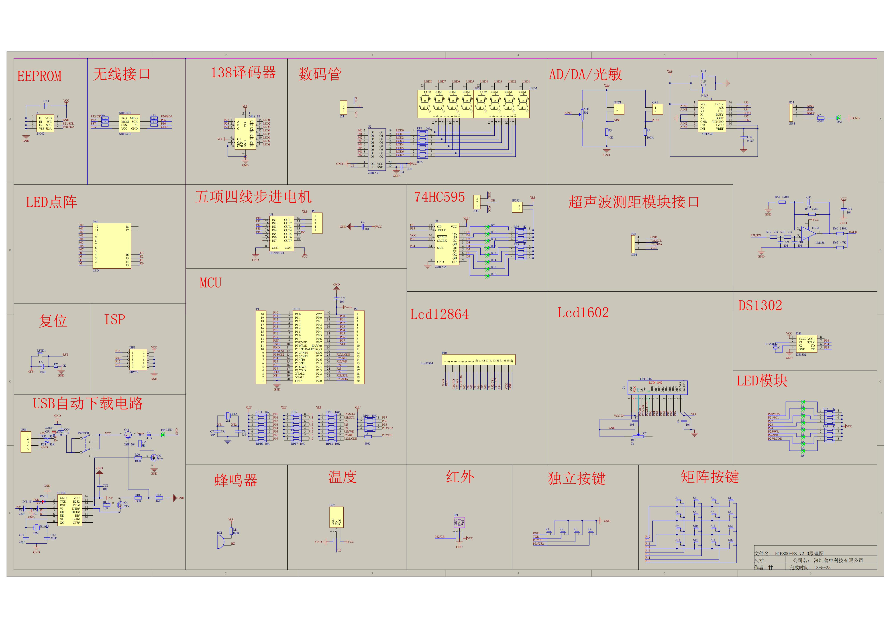

# HC6800-ES V2.0 开发版

## 原理图

## 元器件表

| Comment | Description | Designator | Footprint | LibRef | Quantity |
|---------|-------------|------------|-----------|--------|----------|
| 74LS138 | 3-Line to 8-Line Decoder/Demultiplexer | 1 | SO-16s | 74LS138 | 1 |
| 24C02   | EEPROM      | 2          | SO-8      | 24C16  | 1        |
| CCU254  | DIP Switch  | A1         | A1        | CCU254 | 1        |
| PT02    | Potentiometer | AD1, RU1 | PT02     | PT02   | 2        |
| L101    | Buzzer      | RZ1        | L101      | BUZZER | 1        |
| 104J(±5%) | Capacitor | C2, C3, C4, CR1, CR3, CR6, CR10, CC2, CC3, CC4, CCS, CC1 | S603 | Cap | 12 |
| 10uF    | Polarized Capacitor (Radial) | C5 | CD4 | Cap-Pol1 | 1 |
| 33p     | Capacitor | C6, C7 | S603 | CAP | 2 |
| 22uF    | Capacitor | C9 | S609W | Cap | 1 |
| 22p     | Capacitor | C11, C12 | S603 | Cap | 2 |
| 0.1uF   | Capacitor | C22, C23 | S603 | CAP | 2 |
| 1uF     | Capacitor | C4 | S609W | CAP | 1 |
| CH340G  | USB to UART Bridge Controller | U1 | SOP-16 | CH340G | 1 |
| 470uF   | Capacitor | CP1 | CD5 | CD | 1 |
| BK33    | CPU        | U2 | DIP40-D | BK33 | 1 |
| 100nF   | Capacitor | CV1 | S603 | Cap | 1 |
| LED     | LED        | D1, D2, D4, D5, D6, D7, D8, D9, D10, D11, D12, D13, D14, D15, D16, DA1, DP | LEDS603 | LED | 18 |
| DS1302  | Real Time Clock | DS1 | SO-8 | DS1302 | 1 |
| DS18B20 | Digital Thermometer | DS2 | R11 | DS18B20 | 1 |
| IR186A  | Infrared Receiver | GR1 | HDR1X2 | Header 2 | 1 |
| IR1     | Infrared Emitter | R11 | R11 | IR | 1 |
| ISP52   | ISP Connector | P1, P2 | IDC10 | HEADER 5X2 | 1 |
| LCD1602 | Character LCD Module | J2 | SIP16 | LCD1602 | 1 |
| JP3     | Connector | J21, JOE | SIP3 | CONN3 | 1 |
| JP2     | Header, 2-Pin | JP55 | SIP2 | Header 2 | 1 |
| K1, K2, K3, K4, S1, S2, S3, S4, S5, S6, S7, S8, S9, S10, S11, S12, S13, S14, S15, S16 | Connector | JZ-SW2 | JZ-SW2 | Component_1 | 21 |
| LED (Red) | LED | Led1-Led18 | LED | Component_1 | 18 |
| 3.3V/5V | LED | LED1, LED2 | 3.3V/5V | LED | 2 |
| NRF2401 | RF Transceiver | NRF2401 | HDR2X4 | NRF2401 | 1 |
| NTC1    | Temperature Sensor | NTCT1 | HDR1X2 | Header 2 | 1 |
| BP20    | Header, 20-Pin | P1, P2 | HDR1X20 | Header 20 | 2 |
| BP5     | Header, 5-Pin | P3 | HDR1X5 | Header 5 | 1 |
| LotD2884 | Header, 20-Pin | P10 | SIP20 | Header 20 | 1 |
| JP4     | Connector | J4 | JP4 | JP4 | 1 |
| JP4     | Connector | P24 | SIP4 | JP4 | 1 |
| SWP     | Power Switch | SWP | SWP-2P | SWP-2P | 1 |
| 2Y      | Crystal | Q1, Q2 | NPW-2TY | BS50 | 2 |
| 2SB1204 | Diode | Q11 | 2SB1204 | 2SB1204 | 1 |
| 470R    | Resistor | R2, R54, R56 | S603 | Res2 | 3 |
| 10K     | Resistor | R3, R7, R8, R21 | S603 | R, Res2 | 4 |
| 100K    | Resistor | R4 | S603 | R4 | 1 |
| 1K      | Resistor | R6, R13, R14, R15, R16, R17 | S603W | Res2 | 6 |
| 4.7K    | Resistor | R9, R67 | S603 | R, Res2 | 2 |
| 330R    | Resistor | R10, R60 | S603 | Res2 | 2 |
| 100R    | Resistor | R11, R70 | S603 | Res2 | 2 |
| 56K     | Resistor | R12 | S603 | Res2 | 1 |
| 33R     | Resistor | R52, R53 | S603 | Res1 | 2 |
| SR      | Resistor | R55 | S603 | Res2 | 1 |
| 51K     | Resistor | R62, R63 | S603 | Res2 | 2 |
| 100R(±5%) | Resistor | RP4, RP5 | S603-4 | RES4 | 2 |
| 1K(±5%) | Resistor | RP6, RP7, RP8 | S603-4 | RES4 | 4 |
| 10K(±5%) | Resistor | RP11, RP12, RP13, RP14, RP16, RP17, RP18 | S603-4 | RES4 | 7 |
| XPT2046 | Touch Screen Controller | U1 | SSOP-16 | ADS7843 | 1 |
| 74HC573 | Octal D-Type Flip-Flop with 3-State Outputs | U2 | SO20W | 74S73 | 1 |
| 74HC595 | 8-Bit Shift Register with 3-State Output Registers | U3 | SO-16s | SN74HC595D | 1 |
| LA2003SD | Seven Segment Display Driver | U4 | SO-16s | LA2003SD | 1 |
| LM358 | Fast Settling Dual Operational Amplifier | U6 | SO-8 | LM358 | 1 |
| Header 5 | Header, 5-Pin | USB | MiniUSB | Header 5 | 1 |
| 12M(±5%) | Crystal | XTAL | RAD-0.2 | CRYSTAL | 1 |
| 12M(±5%) | Crystal | XTAL1 | g(±) | CRYSTAL | 1 |