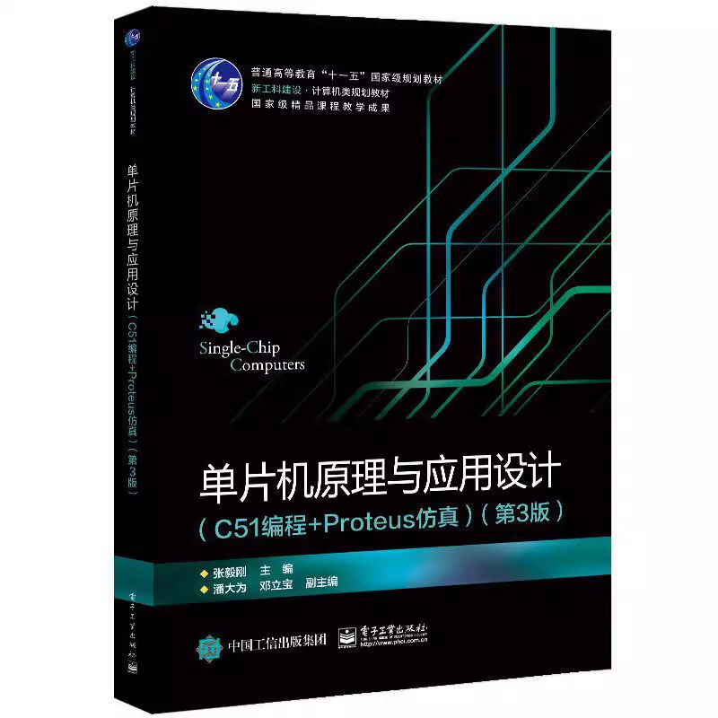

# MCU Courseworks

This repository contains coursework projects related to microcontroller (MCU) programming and embedded systems.

Any questions or suggestions are welcome to contact me 
via email [**carm@carm.cc**](mailto:carm@carm.cc) or [issues](https://github.com/CarmJos/mcu-courseworks/issues/new) .

## Project Structure

- `lib/` The generic abstracted library codes. 
- `projects/`
  - `<course>.<part>-<description>/`
    - `design.pdsprj` The protus simulation project.
    - `project.uvopt` & `project.uvproj` The Keil project settings.
    - `*.c` & `*.h` Codes.
- `docs/` The documentations.

## Prerequisites

- A compatible MCU development board.
- Required software tools (e.g., IDE, compilers, debuggers).

## Open Source Licence

The source code of this project adopts the [GNU General Public License v3.0](https://opensource.org/licenses/GPL-3.0).

## Supports

Many thanks to Jetbrains for kindly providing a license for us to work on this and other open-source projects.  

