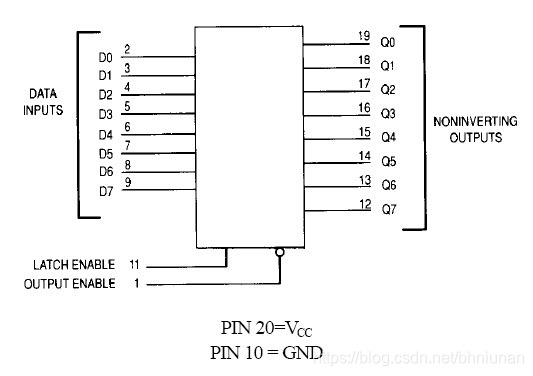
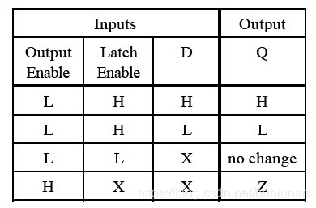
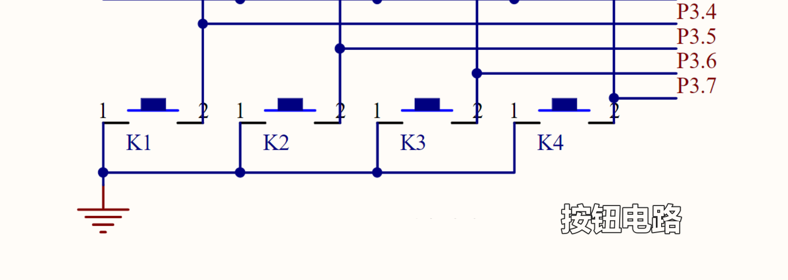
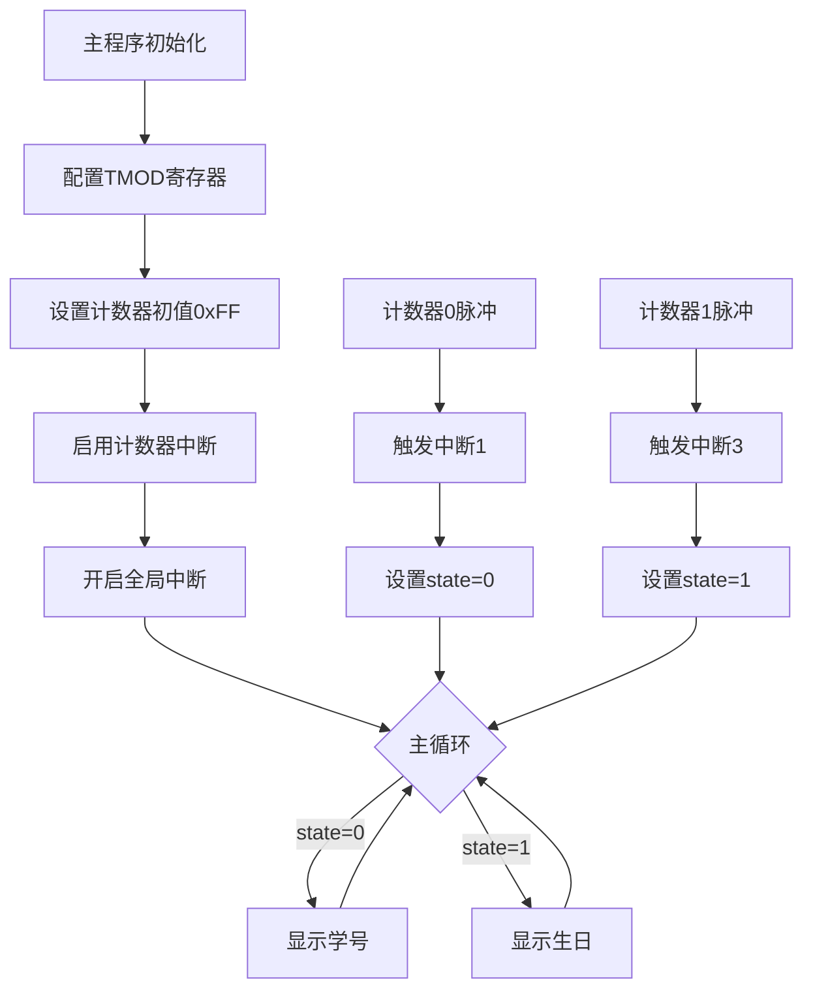

# 数字显示

## 功能要求
开发板上数码管两屏显示你的学号后八位和生日。按键控制。

- **按键1** 按下，显示学号后8位;
- **按键2** 按下，显示生日。
  
  
## 硬件电路设计
电路图如下：

74HC573是一款典型的锁存器芯片，它的内部逻辑图如下图所示。

由真值表中可以看出，Output Enable为高电平时，无论Latch Enable与D端为何种电平状态，其输出都为高阻态，此时芯片处于不可控状态。所以在设计电路是我们直接将Output Enable接地，也就是74HC573一直处于使能状态。

当Output Enable为低电平，且Latch Enable为高电平时，D与Q同时为H或L。当Latch Enable为低电平时，无论D为何种电平，Q都保持上一次的数据状态。

锁存器就是把当前的状态锁存起来，使输入的数据在接口电路的输出端保持一段时间锁存后状态不再发生变化，直到解除锁存。锁存引脚高电平表示直通状态，为低电平表示锁存状态，可以通过控制锁存引脚，控制74HC573后端输出数据。

## 程序设计

见 `main.c` 。

本设计通过定时器计数器中断切换学号显示和生日显示两种模式。系统分为三个核心模块：

- 显示驱动模块。负责动态扫描8位数码管，使用P0口输出段选/位选信号，通过74HC573锁存器（LATCH_SEG/LATCH_BIT）实现数据保持；内置位选编码表(BIT_CODES)实现快速位切换，采用1ms延时(delay)保证显示稳定性。
- 主控模块，初始化定时器/计数器（TMOD=0x66），配置计数器0/1为模式2（自动重装），设置计数器初值(0xFF)实现单脉冲触发，启用全局中断(EA=1)及计数器中断(ETx=1)，主循环根据状态变量(state)选择显示内容。
- 中断控制模块。计数器0中断(interrupt 1)：切换到学号显示模式，计数器1中断(interrupt 3)：切换到生日显示模式，通过修改全局状态变量(state)实现模式切换。

## 调试过程

通过STC-ISP 烧录程序进入单片机后，测试功能一切正常，按钮正常切换显示。