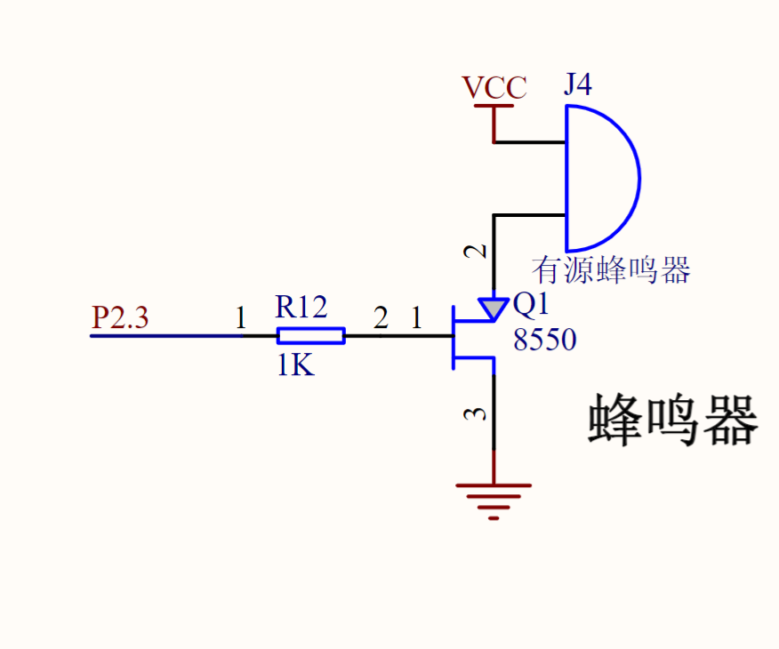
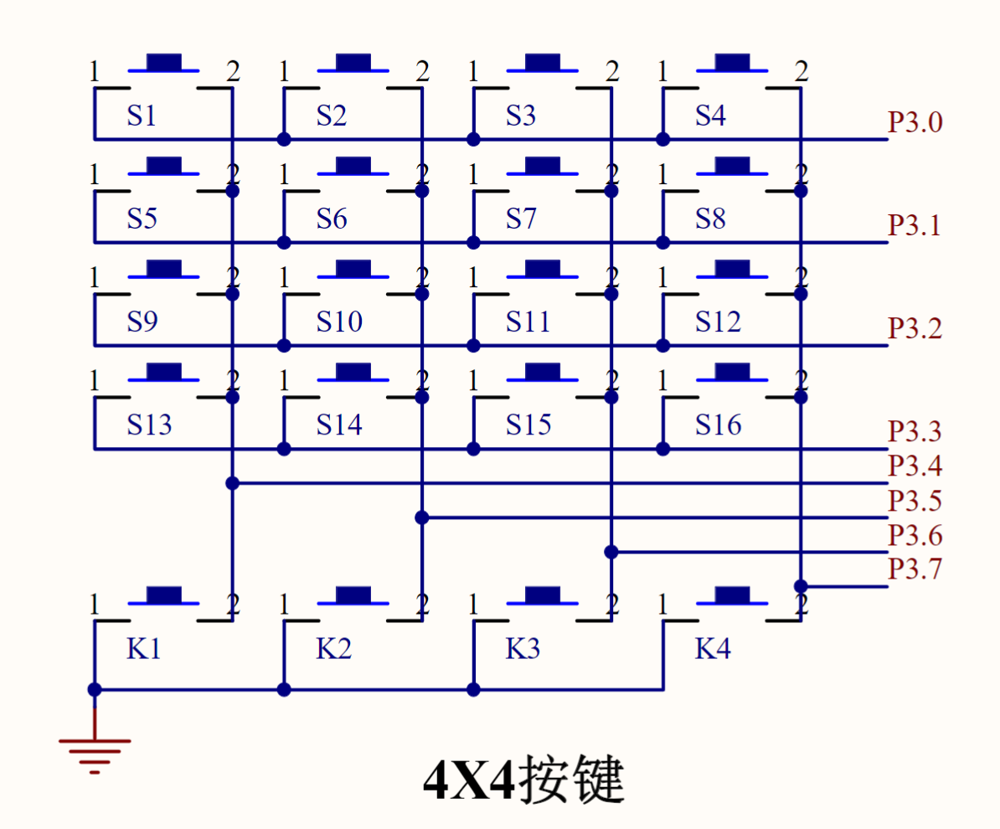
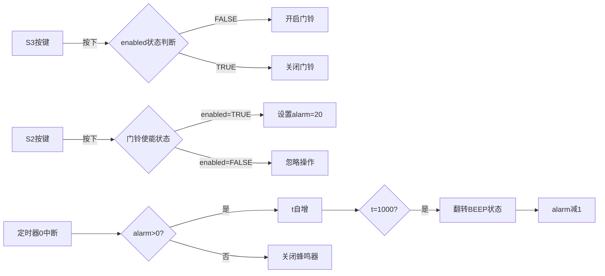

# 门铃

## 功能要求

模拟简易门铃；且有关闭门铃功能。

当按下BST-V51上的S2键后，蜂鸣器会发出十次短暂的“嘟嘟”声作为呼叫。
S3用于关闭或者打开门铃。

当门铃处于关闭时，按下S2不会有呼叫效果。

## 硬件电路设计
本实验利用矩阵键盘与蜂鸣器实现门铃功能。

## 程序设计

为实现基于矩阵键盘控制的智能门铃系统，核心功能包括门铃开关状态控制和触发式蜂鸣提示。系统分为三个关键模块：

键盘扫描模块，采用4×4矩阵键盘检测机制，通过read_keys()函数实现双扫描防抖处理首次扫描(P3=0xF0)检测行信号，二次扫描验证按键真实性，使用位运算pressing(x,y)精准定位S2(1,0)和S3(0,0)物理按键。同时，加入50ms延时消除机械抖动，确保输入稳定。
状态控制模块。全局变量enabled表征门铃开关状态（FALSE=关闭），S3(0,3)按键实现状态翻转：enabled = !enabled；S2(0,2)触发条件判断：仅当enabled=TRUE时设置alarm=20
蜂鸣驱动模块。定时器0配置为模式2自动重装(TMOD=0x22)，中断服务程序实现蜂鸣节奏控制：静态变量t累计中断次数（每中断自增1），当t=1000时翻转BEEP状态，产生"嘟"声，alarm奇偶控制发声相位（偶开/奇关），每次触发完成alarm--直至归零。

## 调试过程

通过STC-ISP 烧录程序进入单片机后，调试时，实测按钮存在些许鬼影问题，通过加入额外一次防抖读取解决。其余功能一切正常。
