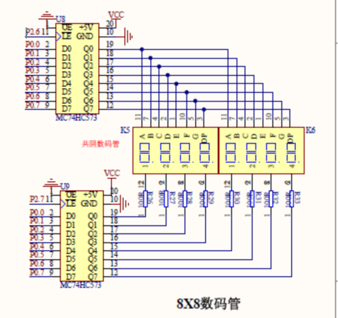
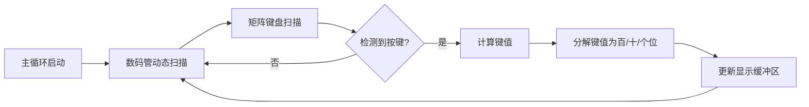

# 矩阵键盘

## 功能要求

数码管显示按下的矩阵键盘的数字。

## 硬件电路设计

## 程序设计

系统采用行列反转扫描法检测按键，并通过动态扫描技术实现三位数显示。设计关键在于构建键盘扫描与显示刷新的协同机制——键盘扫描采用keypad4_transpose_read函数实现行列信号翻转检测，当检测到有效按键时，通过write函数将按键编号(1~16)分解为百位、十位、个位，存入显示缓冲区NUMS数组的末三位。

数码管驱动模块延续了动态扫描架构，但针对键盘响应特性进行了优化：将扫描延时调整为2ms以平衡刷新率与响应速度，同时采用右对齐显示策略（仅使用末三位数码管）。值得注意的是，键盘扫描函数通过pad_read和pad_write抽象层实现硬件隔离，这种设计使系统可适配不同端口的矩阵键盘。主循环中，程序持续轮询键盘状态并刷新显示，当检测到按键按下时，通过位运算 `input & (1<<i)` 定位具体键位，并依据行列坐标计算键值（键值=`x+y*4+1`）。

## 调试过程

## 小结