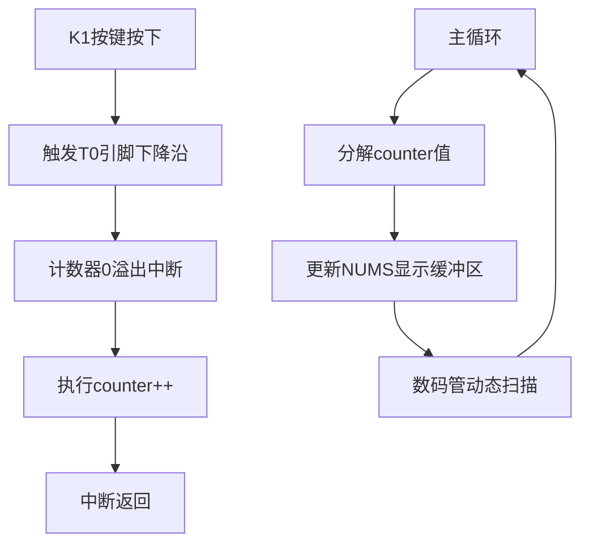

# 按键计数器

## 功能要求

记录实验板上K1键按下的次数，并用数码管显示出来。

## 硬件电路设计

考虑到K1接入P3.4引脚，故本次采用计时器溢出的方式实现按键。

## 程序设计

本实验系统采用计数器0的工作模式2（自动重装），配置TMOD=0x66使T0引脚（P3.4）响应下降沿触发。每当K1按键按下时，计数器从初值0xFF溢出产生中断，在中断服务程序中对全局变量counter执行自增操作。主循环中，程序将counter分解为8位十进制数，分别存入NUMS数组对应位置（索引0为千万位，索引7为个位），通过动态扫描驱动数码管实现全8位显示。数字分解采用连续除模运算，从个位到千万位逐级提取数字，这种算法相比库函数itoa节省了2KB内存空间。

## 调试过程

通过STC-ISP 烧录程序进入单片机后，测试功能一切正常，按钮正常切换显示。