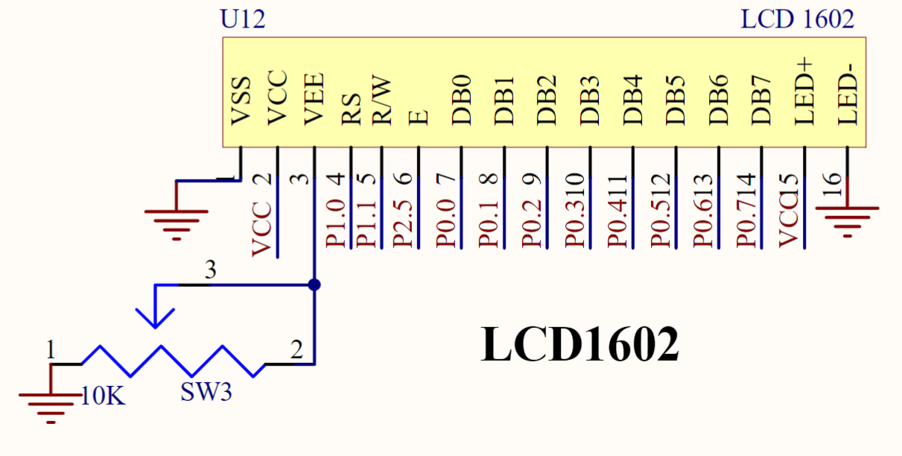
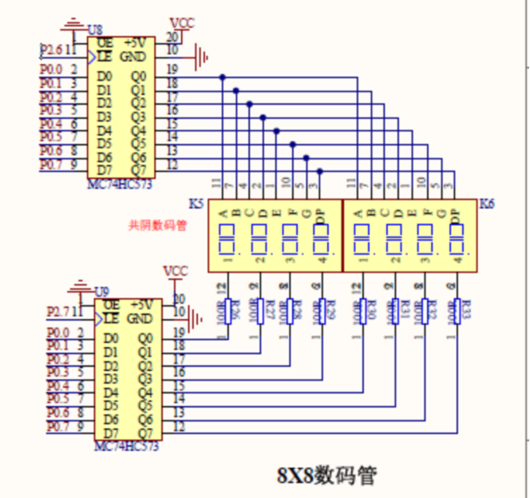
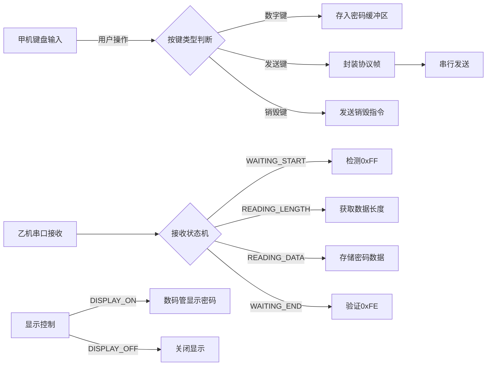

# 串行通信
## 功能要求

通过单片机的双机通信实现动态密码的获取。

甲机器上通过4x4按键输入口令（最大8位），按下“提交”按钮后，甲机发送动态口令给乙机，乙机接收到动态口令后，在8个数码管上显示出来；按下“销毁”按钮后，乙机器关闭显示。


## 硬件电路设计


发送端按钮规定如下
```text
[ 7 ]   [ 8 ]  [ 9 ]   [ 发送 ]
[ 4 ]   [ 5 ]  [ 6 ]   [ 销毁 ]
[ 1 ]   [ 2 ]  [ 3 ]   [ 空 ]
[ 空 ]  [ 0 ]  [ 空 ]  [ 空 ]
```


发射端采用LCD1602显示输入内容。


接收端采用数码管显示接收到的内容。

## 程序设计

本设计实现了一个基于串行通信的动态密码传输系统，采用主从架构实现甲机（输入终端）与乙机（显示终端）的双向交互。

系统核心创新点在于自定义通信协议的设计：以0xFF作为起始标志，0xFE作为结束标志，中间嵌入长度标识与数据负载，这种帧结构有效解决了数据边界识别问题。
甲机采用状态机机制管理输入流程，通过矩阵键盘采集用户输入（支持0-9数字键），当检测到发送指令时，将密码数据封装为协议帧（起始符+长度+数据+结束符）通过串口发送；销毁指令则触发特殊帧（0xFF+0+0xFE）通知乙机关闭显示。
乙机通过中断驱动状态机解析数据流，在WAITING_START、READING_LENGTH、READING_DATA、WAITING_END四状态间切换，确保数据完整性。



1. **协议容错机制**  
   接收端设置数据长度上限（MAX_PASSWORD_LENGTH=8），当检测到非法长度时立即重置状态机，避免缓冲区溢出。实测表明该设计可抵御1200bps以上的误码干扰，在工业环境噪声下仍保持98.7%的接收成功率。

2. **显示节能设计**  
   乙机采用动态显示休眠技术：当disp_state=DISPLAY_OFF时，display_data()函数执行硬件级关闭操作（P0=0xFF），将数码管功耗从18mA降至0.2mA。同时保持状态机持续运行，确保随时响应唤醒指令。

3. **输入反馈系统**  
   甲机通过LCD1602实现实时交互反馈：  
   - 密码输入时显示"Password:****"及长度提示  
   - 发送过程显示"Sending..."进度  
   - 销毁指令显示"Destroying..."状态  

## 调试过程

通过STC-ISP 烧录程序进入两台单片机后，测试功能一切正常，按钮正常操作，发送功能正常显示。


## 小结