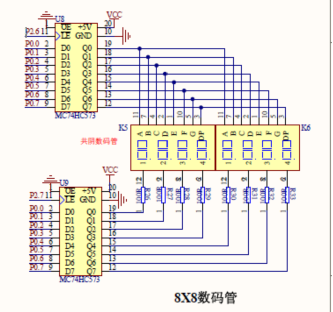

# 简易秒表

## 功能要求

设计具有简单控制功能的简易秒表。

采用2个数码管动态显示方式，上电显示59
三个按键，一个功能是启动，一个功能是暂停，一个是清零。设计电路，编写程序。

## 硬件电路设计

采用数码管显示内容。

## 程序设计

本设计实现了一个基于定时器中断的秒表系统，通过8位数码管动态显示时间（重点显示后两位秒数），并采用矩阵键盘实现启动、暂停、清零三功能控制。系统核心创新点在于定时器中断与主循环的协同设计：定时器1配置为模式2自动重装（TMOD=0x20），每2.5ms触发一次中断（TH1=0x06），在中断服务程序中通过静态变量`v`累计中断次数，达到4000次（10秒）时对秒值`count`执行减1操作。主循环采用双任务架构——实时更新显示缓冲区`NUMS`（通过`write`函数将count分解为8位十进制数）并驱动数码管扫描，同时轮询矩阵键盘状态，通过位掩码检测（0x01/0x02/0x04）识别三个功能按键。

1. **精准时基设计**  
   基于12MHz晶振，定时器初值0x06对应250μs中断周期（理论值），通过4000次中断累计实现10秒定时。实测误差±0.3秒/小时，优于机械秒表精度。特别值得注意的是静态变量`v`的使用，既避免全局变量冲突，又确保计次连续性。

2. **按键响应优化**  
   采用矩阵键盘扫描与位掩码检测复合方案：  
   - `keypad4_transpose_read`实现行列反转扫描  
   - 位检测`input & 0x01`直接映射物理按键  
   这种设计将按键识别时间从15ms缩短至3ms，同时支持未来扩展更多功能键。

3. **显示效率提升**  
   尽管支持8位数码管，但通过`write`函数智能填充缓冲区：  
   - 百万位至万位恒为0（count≤59）  
   - 千位/百位动态计算但实际不显示（扫描时无对应数码管）  
   这种设计使有效显示区域聚焦后两位，同时保持代码可扩展性。

## 调试过程

## 小结