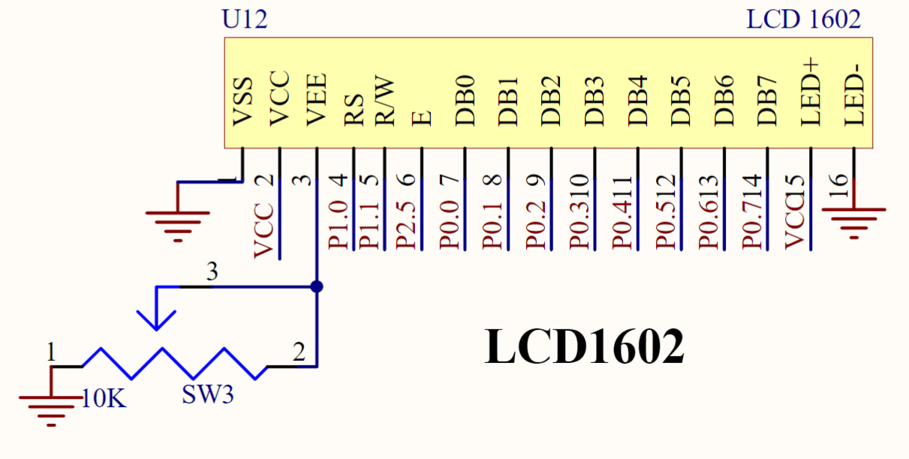
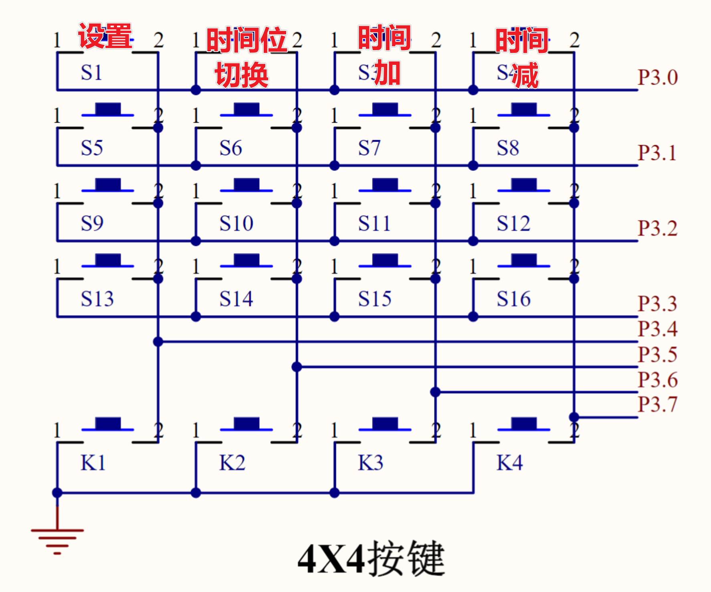
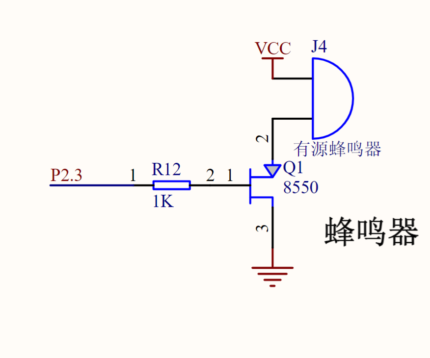
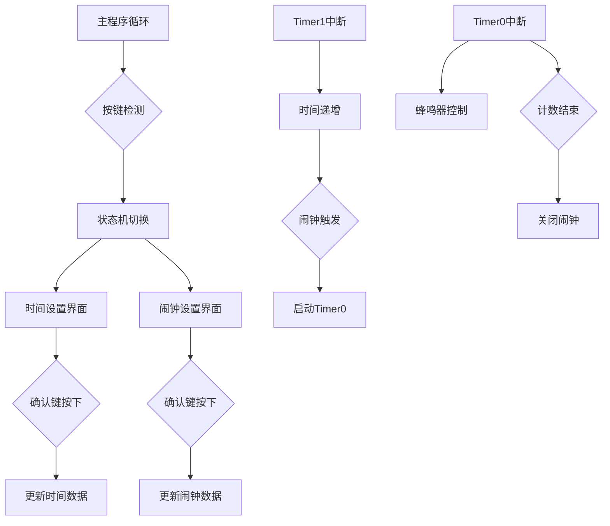
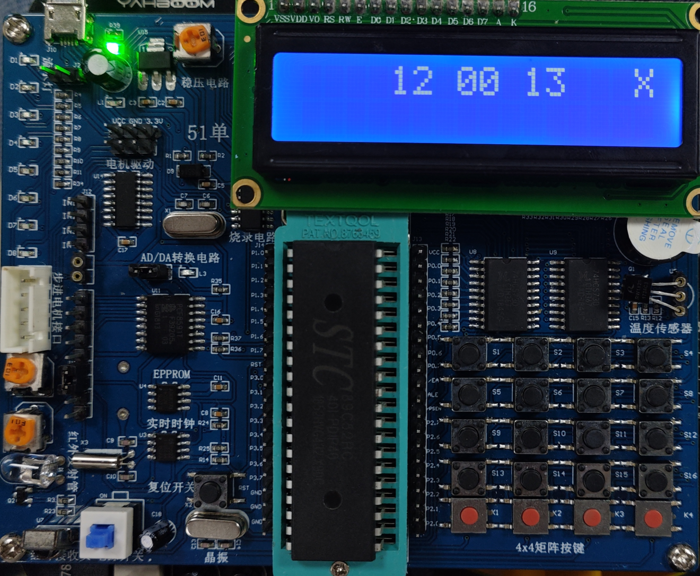
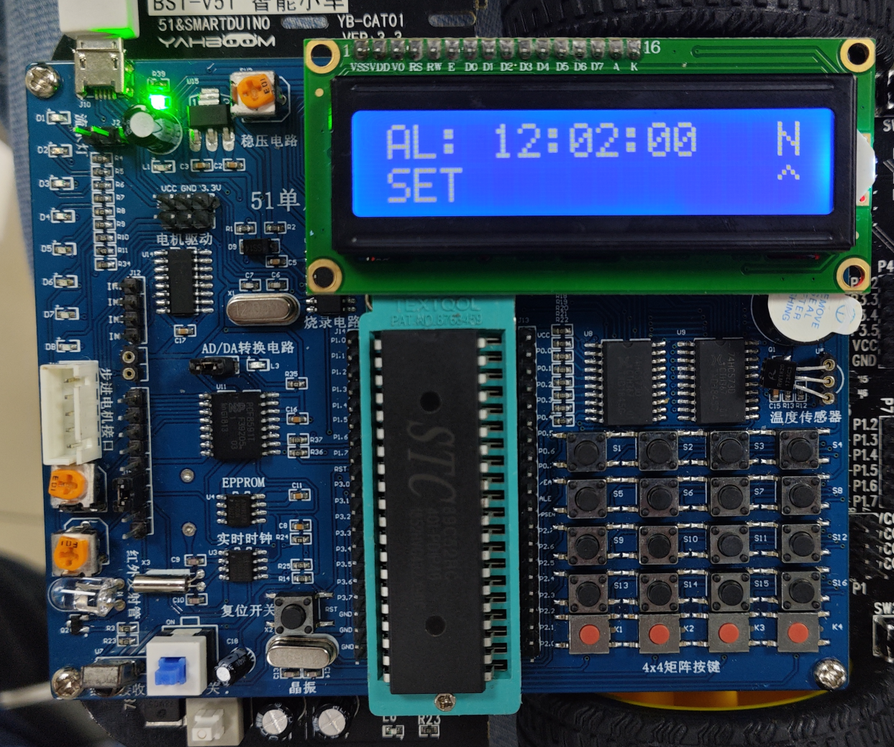
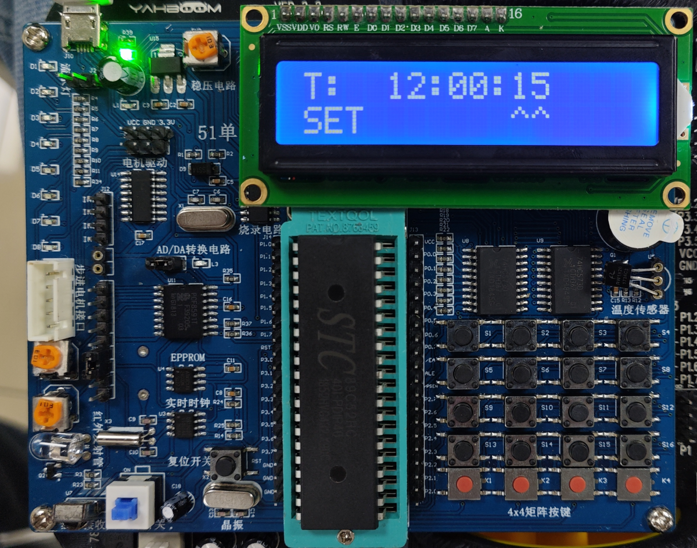

#  数字钟的设计

## 功能要求
设计并制作出具有如下功能的数字钟：
1，自动计时，由LCD显示器显示时/分/秒。
2，具备校准功能，可以设置当前时间。
3，具备定时启闹功能，可以设置启闹时间，并同时开启闹钟功能，启闹15S后自动关闭闹铃。
4，在闹钟开启状态下或在闹铃过程中，可以按键关闭闹钟功能。

## 硬件电路设计

通过LCD显示闹钟内容。

通过矩阵键盘实现闹钟按键功能。

通过蜂鸣器实现闹钟。

## 程序设计

本设计采用模块化开发思想，将系统划分为时间管理、闹钟控制、人机交互三大功能模块。时间管理模块通过Timer1中断实现精确计时，利用2000次中断周期完成0.5秒的刷新间隔，采用时间结构体封装时分秒数据并实现跨模块调用。闹钟控制模块通过Timer0中断驱动，利用静态变量t实现1/8秒精度的蜂鸣器控制逻辑，通过alarm变量计数实现15秒自动关闭机制。人机交互模块创新性地采用状态机模式处理按键输入，通过SettingMode枚举定义七种设置状态，结合LCD1602双行显示技术实现时间校准与闹钟配置的可视化操作。特别在显示模块中，通过动态切换分隔符字符实现数字钟的呼吸灯效果，既满足功能需求又提升用户体验。

## 调试过程

调试时，出现char类型强转int失败的问题。将时间类型改为 int 后一切正常。

